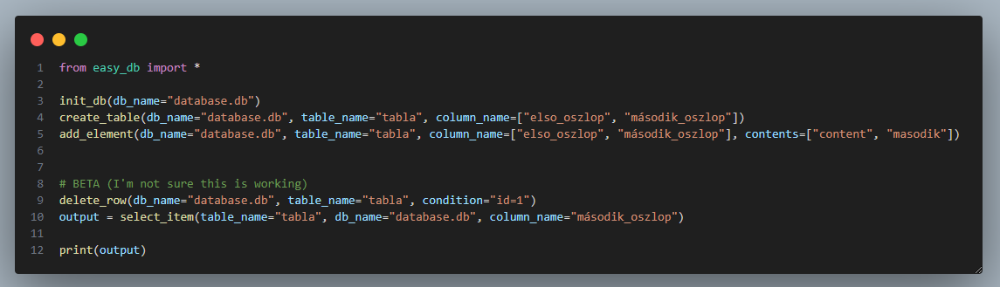

Leírás/Description:
- <a href="#english">English</a>
- <a href="#magyar">Magyar</a>


# English
### Install
- Linux/mac:
    1. Visit the `https://github.com/simsononroad/easy_sqlite_db/releases/tag/0.1` url
    2. Download the `start.sh` file to the folder where you want to work
    3. give `run as program` to the `start.sh`
    4. run in the terminal whit the `./start.sh` command

- Windows:
    1. Visit the `https://github.com/simsononroad/easy_sqlite_db/releases/tag/w0.1` url
    2. Download the `start.bat` file to the folder where you want to work
    4. run the `start.bat` file


### usage
- `init_db(database_name)` 
    - -> database_name: `str`
- `create_table(database_name, table_name, columns)`
    - -> database_name: `str`
    - -> table_name: `str`
    - -> columns: `list`

- `add_element(database_name, table_name, columns, content)`
    - -> database_name: `str`
    - -> table_name: `str`
    - -> columns: `list`
    - -> content: `list`
- `select_item(database_name, table_name, columns)`, return -> Items
    - -> database_name: `str`
    - -> table_name: `str`
    - -> columns: `list`
- `update_row(database_name, table_name, coloumn_name, new_value, condition)`
    - -> database_name: `str`
    - -> table_name: `str`
    - -> coloumn_name: `str`
    - -> new_value: `str`/`int`
    - -> condition: `str`
- `delete_row(database_name, table_name, condition)`
    - -> database_name: `str`
    - -> table_name: `str`
    - -> condition: `str`
    - condition example
        > [column name] : [value]
        
        > name: jack


### Developer mode
- This can help for the developers when they want to start the code quickly

- `quick_start(coloumn_name)`
    - -> coloumn_name: `list`
    - Description
        - This will creat the database with `database.db` name and the table with `tables` name
        
- `quick_add(coloumn_name, contents)`
    - -> coloumn_name: `list`
    - -> contents: `list`

- `quick_select(coloumn_name)`
    - -> coloumn_name: `list`
- `quick_delete(condition)`
    - condition example
        > [coloumn name] : [value]
        
        > name: david


# Magyar
# Telepítés
- Linux/mac:
    1. Látogass el a `https://github.com/simsononroad/easy_sqlite_db/releases/tag/0.1` URL-re
    2. Töltsd le a `start.sh` fájlt abba a mappába, ahol dolgozni szeretnél
    3. Adj futtatási jogosultságot a `start.sh` fájlnak
    4. Futtasd a terminálban a `./start.sh` parancs segítségével

- Windows:
    1. Látogass el a `https://github.com/simsononroad/easy_sqlite_db/releases/tag/w0.1` URL-re
    2. Töltsd le a `start.bat` fájlt abba a mappába, ahol dolgozni szeretnél
    3. Futtasd a `start.bat` fájlt

# Használat
- `init_db(database_name)`
    - -> database_name: `str`
- `create_table(database_name, table_name, columns)`
    - -> database_name: `str`
    - -> table_name: `str`
    - -> columns: `list`

- `add_element(database_name, table_name, columns, content)`
    - -> database_name: `str`
    - -> table_name: `str`
    - -> columns: `list`
    - -> content: `list`
- `select_item(database_name, table_name, columns)`, visszatérési érték -> `list`
    - -> database_name: `str`
    - -> table_name: `str`
    - -> columns: `str`
- `update_row(database_name, table_name, coloumn_name, new_value, condition)`
    - -> database_name: `str`
    - -> table_name: `str`
    - -> coloumn_name: `str`
    - -> new_value: `str`/`int`
    - -> condition: `str`

- `delete_row(database_name, table_name, condition)`
    - -> database_name: `str`
    - -> table_name: `str`
    - -> condition: `str`
    - condition example
        > [oszlop neve] : [érték]
        
        > nev: david


### Fejlesztőknek:
- Ez segíthet a fejlesztőknek ha csak tesztelni szeretnének és nem akarnak a nevekkel bajlódni

- `quick_start(coloumn_name)`
    - -> coloumn_name: `list`
    - Description
        - Ez megfogja csinálni az adatbázist `database.db` néven és létrehoz egy táblát `tables` néven.
        
- `quick_add(coloumn_name, contents)`
    - -> coloumn_name: `list`
    - -> contents: `list`

- `quick_select(coloumn_name)`
    - -> coloumn_name: `list`
- `quick_delete(condition)`
    - condition example
        > [oszlop neve] : [érték]
        
        > name: david


# Példa:


```
init_db(db_name="database.db")
create_table(db_name="database.db", table_name="tabla", coloumn_name=["elso_oszlop", "második_oszlop"])
add_element(db_name="database.db", table_name="tabla", coloumn_name=["elso_oszlop", "második_oszlop"], contents=["content", "masodik"])
output = select_item(table_name="tabla", db_name="database.db", coloumn_name="elso_oszlop")
```


