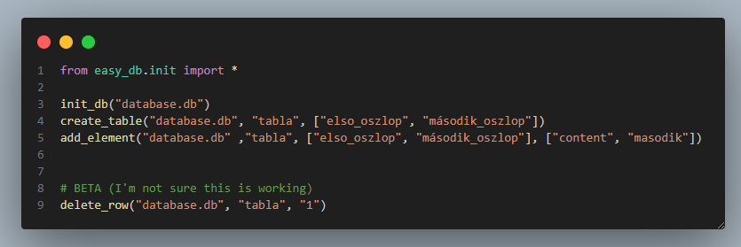

Leírás/Description:
- <a href="#english">English</a>
- <a href="#magyar">Magyar</a>


# English
# Install
- Linux/mac:
    1. Visit the `https://github.com/simsononroad/easy_sqlite_db/releases/tag/0.1` url
    2. Download the `start.sh` file to the folder where you want to work
    3. give `run as program` to the `start.sh`
    4. run in the terminal whit the `./start.sh` command

- Windows:
    1. Visit the `https://github.com/simsononroad/easy_sqlite_db/releases/tag/w0.1` url
    2. Download the `start.bat` file to the folder where you want to work
    4. run the `start.bat` file


# usage
- `init_db(database_name)` 
    - -> database_name: `str`
- `create_table(database_name, table_name, columns)`
    - -> database_name: `str`
    - -> table_name: `str`
    - -> columns: `list`

- `add_element(database_name, table_name, columns, content)`
    - -> database_name: `str`
    - -> table_name: `str`
    - -> columns: `list`
    - -> content: `list`
- `select_item(database_name, table_name, columns)`, return -> Items
    - -> database_name: `str`
    - -> table_name: `str`
    - -> columns: `str`
- `update_row(database_name, table_name, column_name, new_value, condition)`
    - -> database_name: `str`
    - -> table_name: `str`
    - -> column_name: `str`
    - -> new_value: `str`/`int`
    - -> condition: `str`

# example:
```
init_db("database.db")
create_table("database.db", "tabla", ["elso_oszlop", "második_oszlop"])
add_element("database.db" ,"tabla", ["elso_oszlop", "második_oszlop"], ["content", "masodik"])
output = select_item("database.db", "tabla", "elso_oszlop)

```


- or

```
init_db(db_name="database.db")
create_table(db_name="database.db", table_name="tabla", column_name=["elso_oszlop", "második_oszlop"])
add_element(db_name="database.db", table_name="tabla", column_name=["elso_oszlop", "második_oszlop"], contents=["content", "masodik"])
output = select_item(table_name="tabla", db_name="database.db", column_name="elso_oszlop")
```


# Magyar
# Telepítés
- Linux/mac:
    1. Látogass el a `https://github.com/simsononroad/easy_sqlite_db/releases/tag/0.1` URL-re
    2. Töltsd le a `start.sh` fájlt abba a mappába, ahol dolgozni szeretnél
    3. Adj futtatási jogosultságot a `start.sh` fájlnak
    4. Futtasd a terminálban a `./start.sh` parancs segítségével

- Windows:
    1. Látogass el a `https://github.com/simsononroad/easy_sqlite_db/releases/tag/w0.1` URL-re
    2. Töltsd le a `start.bat` fájlt abba a mappába, ahol dolgozni szeretnél
    3. Futtasd a `start.bat` fájlt

# Használat
- `init_db(database_name)`
    - -> database_name: `str`
- `create_table(database_name, table_name, columns)`
    - -> database_name: `str`
    - -> table_name: `str`
    - -> columns: `list`

- `add_element(database_name, table_name, columns, content)`
    - -> database_name: `str`
    - -> table_name: `str`
    - -> columns: `list`
    - -> content: `list`
- `select_item(database_name, table_name, columns)`, visszatérési érték -> `list`
    - -> database_name: `str`
    - -> table_name: `str`
    - -> columns: `str`
- `update_row(database_name, table_name, column_name, new_value, condition)`
    - -> database_name: `str`
    - -> table_name: `str`
    - -> column_name: `str`
    - -> new_value: `str`/`int`
    - -> condition: `str`

# Példa:
```
init_db("database.db")
create_table("database.db", "tabla", ["elso_oszlop", "második_oszlop"])
add_element("database.db" ,"tabla", ["elso_oszlop", "második_oszlop"], ["content", "masodik"])
output = select_item("database.db", "tabla", "elso_oszlop")
```


- vagy

```
init_db(db_name="database.db")
create_table(db_name="database.db", table_name="tabla", column_name=["elso_oszlop", "második_oszlop"])
add_element(db_name="database.db", table_name="tabla", column_name=["elso_oszlop", "második_oszlop"], contents=["content", "masodik"])
output = select_item(table_name="tabla", db_name="database.db", column_name="elso_oszlop")
```


