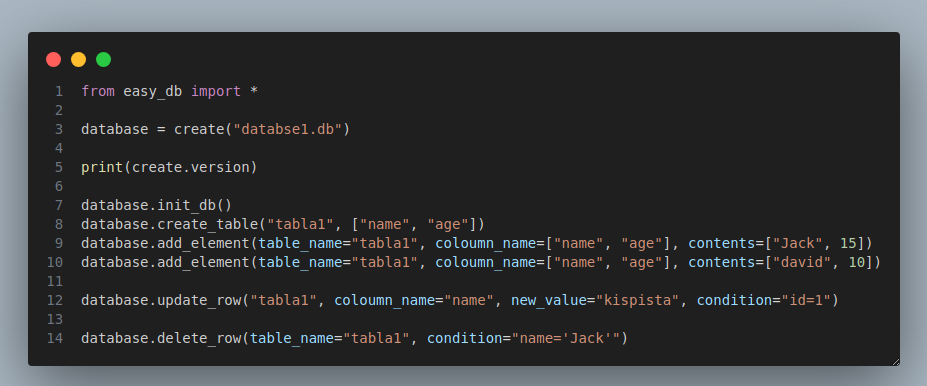
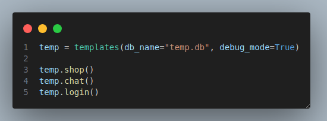

Leírás/Description:
- <a href="#english">English</a>
- <a href="#magyar">Magyar</a>
- <a href="https://github.com/simsononroad/easy_sqlite_db/wiki">Documentation</a>


# English
### Install
- Linux/mac:
    1. Visit the `https://github.com/simsononroad/easy_sqlite_db/releases/tag/0.1` url
    2. Download the `start.sh` file to the folder where you want to work
    3. give `run as program` to the `start.sh`
    4. run in the terminal whit the `./start.sh` command

- Windows:
    1. Visit the `https://github.com/simsononroad/easy_sqlite_db/releases/tag/w0.1` url
    2. Download the `start.bat` file to the folder where you want to work
    4. run the `start.bat` file


### usage

- Create table: `[variable name] = create("[database name].db", [True/False])`
    - -> first index: database_name.db
    - -> second index: 
        - `True`: It will print out the log
        - `False`: This will not log out anything

function call: `[variable name].[function name](function parameters)`

<a href="#példa">example</a>

- `init_db(database_name)` 
    - -> database_name: `str`
- `create_table(table_name, columns)`
    - -> database_name: `str`
    - -> table_name: `str`
    - -> columns: `list`

- `add_element(table_name, columns, content)`
    - -> database_name: `str`
    - -> table_name: `str`
    - -> columns: `list`
    - -> content: `list`
- `select_item(table_name, columns)`, return -> Items
    - -> database_name: `str`
    - -> table_name: `str`
    - -> columns: `list`
- `update_row(table_name, coloumn_name, new_value, condition)`
    - -> database_name: `str`
    - -> table_name: `str`
    - -> coloumn_name: `str`
    - -> new_value: `str`/`int`
    - -> condition: `str`
- `delete_row(table_name, condition)`
    - -> database_name: `str`
    - -> table_name: `str`
    - -> condition: `str`
    - condition example
        > [column name] : '[value]'
        
        > name: 'jack'

- `get_db_info(table_name, coloumn_name)`
    - -> table name: `str`
    - -> coloumn_name: `list`
    - return:tuple -> firs: database name || second: coloumns_name || third: number of rows || fourth: number of coloumns (coloumns with the ID coloumn)
### Developer mode
- This can help for the developers when they want to start the code quickly

- `quick_start(coloumn_name)`
    - -> coloumn_name: `list`
    - Description
        - This will creat the database with `database.db` name and the table with `tables` name
        
- `quick_add(coloumn_name, contents)`
    - -> coloumn_name: `list`
    - -> contents: `list`

- `quick_select(coloumn_name)`
    - -> coloumn_name: `list`
- `quick_delete(condition)`
    - condition example
        > [coloumn name] : '[value]'
        
        > name: 'david'


# Magyar
### Telepítés
- Linux/mac:
    1. Látogass el a `https://github.com/simsononroad/easy_sqlite_db/releases/tag/0.1` URL-re
    2. Töltsd le a `start.sh` fájlt abba a mappába, ahol dolgozni szeretnél
    3. Adj futtatási jogosultságot a `start.sh` fájlnak
    4. Futtasd a terminálban a `./start.sh` parancs segítségével

- Windows:
    1. Látogass el a `https://github.com/simsononroad/easy_sqlite_db/releases/tag/w0.1` URL-re
    2. Töltsd le a `start.bat` fájlt abba a mappába, ahol dolgozni szeretnél
    3. Futtasd a `start.bat` fájlt

### Használat

- Tábla létrehozása: `[változó név] = create("[adatbázis név].db", [True/False])`
    - -> ELső index: database_name.db
    - -> Második index: 
        - `True`: Ki fogja írni hogy mit hajtott végre
        - `False`: Nem fogja ki írni hogy mit hajtott végre

Függvény meghívása: `[változó név].[függvény neve](függvény paraméterei)`

<a href="#példa">példa</a>

- `init_db(database_name)`
    - -> database_name: `str`
- `create_table(table_name, columns)`
    - -> database_name: `str`
    - -> table_name: `str`
    - -> columns: `list`

- `add_element(table_name, columns, content)`
    - -> database_name: `str`
    - -> table_name: `str`
    - -> columns: `list`
    - -> content: `list`
- `select_item(table_name, columns)`, visszatérési érték -> `list`
    - -> database_name: `str`
    - -> table_name: `str`
    - -> columns: `str`
- `update_row(table_name, coloumn_name, new_value, condition)`
    - -> database_name: `str`
    - -> table_name: `str`
    - -> coloumn_name: `str`
    - -> new_value: `str`/`int`
    - -> condition: `str`

- `delete_row(table_name, condition)`
    - -> database_name: `str`
    - -> table_name: `str`
    - -> condition: `str`
    - condition example
        > [oszlop neve] : '[érték]'
        
        > nev: 'david'

- `get_db_info(table_name, coloumn_name)`
    - -> table name: `str`
    - -> coloumn_name: `list`
    - return: tuple -> első elem: adatbázis neve || második elem: oszlopok neve || harmadik elem: sorok száma || negyedik elem: oszlopk száma


### Fejlesztőknek:
- Ez segíthet a fejlesztőknek ha csak tesztelni szeretnének és nem akarnak a nevekkel bajlódni

- `quick_start(coloumn_name)`
    - -> coloumn_name: `list`
    - Description
        - Ez megfogja csinálni az adatbázist `database.db` néven és létrehoz egy táblát `tables` néven.
        
- `quick_add(coloumn_name, contents)`
    - -> coloumn_name: `list`
    - -> contents: `list`

- `quick_select(coloumn_name)`
    - -> coloumn_name: `list`
- `quick_delete(condition)`
    - condition example
        > [oszlop neve] : '[érték]'
        
        > name: 'david'


# Példa:


```
from easy_db import *

# Create database
database = create("databse1.db")

print(create.version)

# Create database
database.init_db()

#create table
database.create_table("tabla1", ["name", "age"])

#Add item to database
database.add_element(table_name="tabla1", coloumn_name=["name", "age"], contents=["Jack", 15])
database.add_element(table_name="tabla1", coloumn_name=["name", "age"], contents=["david", 10])

#replace item in database
database.update_row("tabla1", coloumn_name="name", new_value="kispista", condition="id=1")

#Delete item from database
database.delete_row(table_name="tabla1", condition="name='Jack'")

#Return important infos from database
infos = database.get_db_info("tabla1", coloumn_name=["name", "age"])

```


## template

```
temp = templates(db_name="temp.db", debug_mode=True)

temp.shop()
temp.chat()
temp.login()
```


